# HOUSE PRICE PREDICTION

The following project aims to develop a prediction model that serves as a tool for the real estate business. The characteristics that influence house prices will be studied through data analysis.In a highly competitive market, real estate professionals need to leverage data to gain a competitive edge and maximize profitability.
The information to be used for the analysis corresponds to properties located in Seattle, WA.
--- 

# Goals : 
The objective of this project is to develop a robust predictive model that accurately estimates the price of a house by considering specific features. We aim to uncover the relationships between the features and housing prices. This model will serve as a valuable tool for prospective buyers, sellers, and real estate professionals, enabling them to make informed decisions and negotiate fair deals. Through meticulous analysis and modeling, we strive to deliver a reliable and precise house price prediction solution that enhances the efficiency and effectiveness of the real estate market.
---

# Technologies
- Python 
- MySQL
- Tableau

# Structure
The project is structured as follows:
- regression_data.xls
- - DA_real_state6.ipynb
- - house_price_analysis.sql
- - tableau

### Data Manipulation 
pandas, numpy, datetime, pymysql, sqlalchemy, getpass
### Data Visualization
seaborn & matplotlib
### Machine Learning: 
scikit, statsmodels

# Development
 The data set consists of information on some 22,000 properties.  The dataset consisted of historic data of houses sold between May 2014 to May 2015.:
---

# Source Data 
### Identification
ID: Unique identification number for the transaction.

### Time
Date: date the house was sold.

### Characteristics of the property
- Waterfront: house which has a view to a waterfront.
- Condition: How good the condition is (overall). 1 indicates worn out property and 5 excellent.
- Grade: Overall grade given to the housing unit, based on King County grading system. 1 poor ,13 excellent.
- View:
- Floors:
- Bathrooms: Number of Bathrooms.
- Bedrooms: Number of bedrooms.
- Sqft_above: square footage of house apart from basement.
- sqft_living:
- Sqft_living15: Living room area in 2015(implies - some renovations). This might or might not have affected the lotsize area.
- sqft_lot:
- Sqft_lot15: lotSize area in 2015(implies - some renovations).
- sqft_basement: Basement 
- yr_built: Year of construction
- yr_renovated: Year of renewal

### Price
- Price: Price of the house.

### Location
- Long: Longitude
- lat: Latitude
- zipcode 

# Procedure 
To obtain the result, the dataset has undergone data cleaning, followed by data preprocessing, statistical analysis using linear regression, and the training and testing of a predictive model. Additionally, Tableau visualizations and MySQL queries have been performed to generate information that can serve as a tool for decision-making.

During data preparation, I performed queries and modifications in cases where there were null data. I have deleted rows that had duplicate IDs, column names were modified, and particularly in the datetime column, I conducted an analysis to check its relationship with the Price variable, which is the variable on which I would focus the project analysis.

The first variable I analyzed regarding the price was Date. Upon seeing that the scatter plot showed no trend or convergence, I decided to remove it.

The next variables I eliminated were LAT and LONG since, when analyzed together, they maintain a direct relationship with the ZIP code. Additionally, this decision was also related to the subsequent analysis I would conduct in Tableau. 

Then, I analyzed the variables that could be considered categorical, as their numeric value was not dimensional but merely represented a group or category, allowing me to remove the numerical significance they had on each property. This was the case, for example, with WATERFRONT and ZIPCODE.

Regarding the variable BEDROOMS, 99.71% of the data corresponds to properties that have 1 to 6 bedrooms, so I eliminated the outliers that contained more than 6.

### 100% Data 
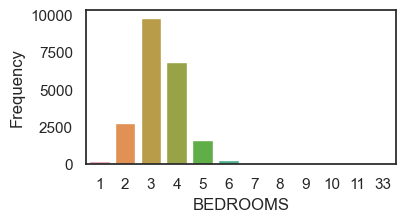

### 99.71%
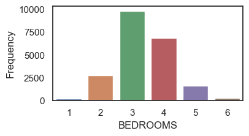

In the case of BATHROOMS, I grouped the data to make it more interpretable. I rounded the multiples of 0.25.

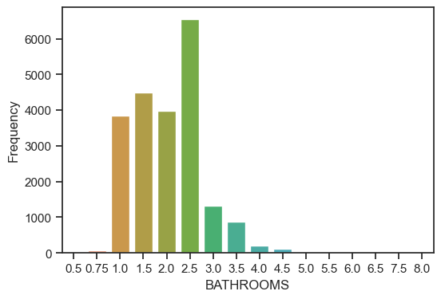

SQFT_LIVING has a sufficiently normal distribution to work with it as it is.

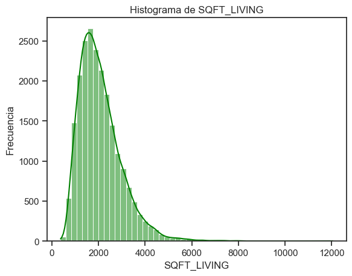

During data processing, for the variables that showed skewness, I performed log-normal transformations.

The variable SQFT_LOT was disregarded since SQFT_LOT15 has updated information on this feature. SQFT_LOT15, on the other hand, was analyzed. It contains outliers and is highly imbalanced, so I applied the logarithm to its data to work with this information more effectively.

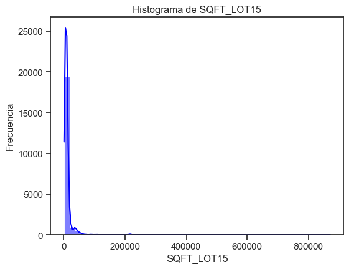 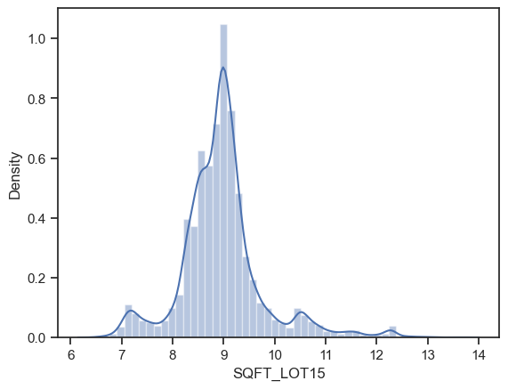 

The price is slightly imbalanced, but I have not made any transformations to its data distribution.

As seen in the following image, SQFT_BASEMENT had many outliers. I decided to transform the data to generate a more useful distribution of the information.

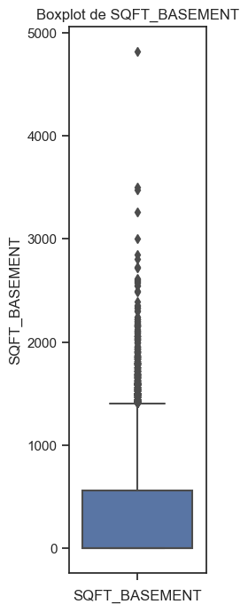

After applying the transformation, the data was distributed as follows.

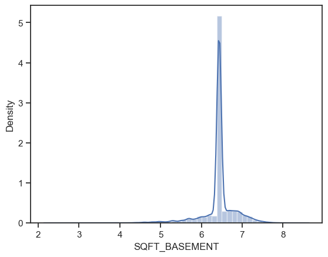

The variables view, condition, grade, yr_build, and yr_renovated were not modified.

The correlations, after applying cleaning and processing, yielded these results.

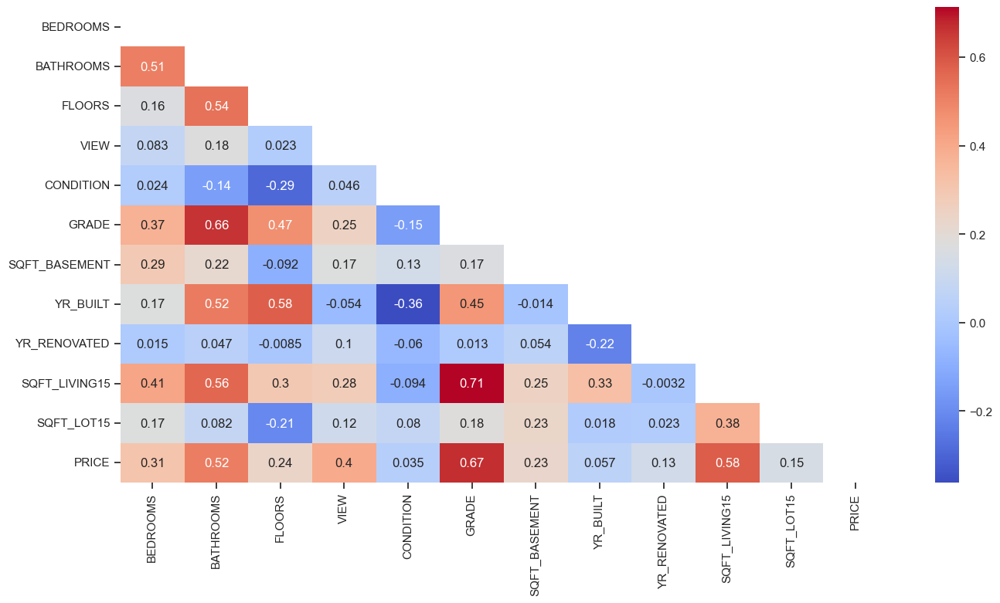

I have scaled the variables that were considered numeric, while I applied the 'One Hot Encoder' technique to the 2 aforementioned categorical variables.

## Multiple Regression using Ordinary Leasts Squares (OLS) method.

Afterward, I performed a linear regression where the dependent variable is PRICE.

For training, I took 80% of the data, leaving 20% for model testing. I conducted 3 tests, where I systematically removed variables that did not contribute significantly to the model in order to improve accuracy.

## Results
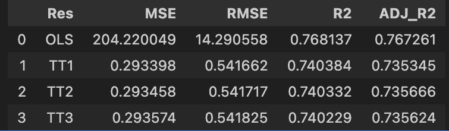

## Conclusions

The results obtained show that over 76% of the variation in the price variable is explained by the variables I have considered for the study.

On the other hand, the removal of variables that do not explain the model was performed during the 3 train-test iterations to observe if the results would improve, but no significant improvements have been observed.

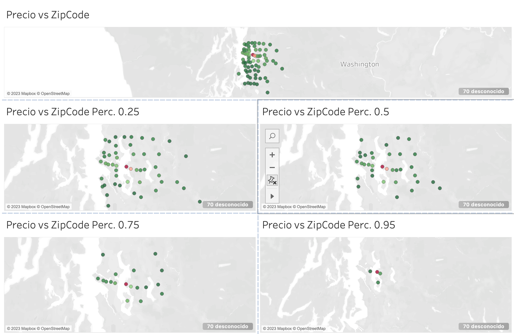

The most expensive properties in Seattle, WA are located in the Medina neighborhood due to a combination of factors that make it an exclusive and attractive location for high-net-worth homebuyers. Some of the key reasons are:

Correlation coef:
ZIPCODE_98039     3.7228

Prime Location: Medina is situated on the eastern shore of Lake Washington, providing stunning views and waterfront access, which is highly valued by buyers seeking a luxurious and scenic lifestyle.

Peaceful and Safe Environment: The neighborhood has a reputation for being a safe, quiet, and exclusive community with low crime rates, which appeals to affluent families seeking a secure and serene living environment.

High-Quality Infrastructure and Services: Medina boasts well-developed infrastructure, excellent schools, parks, quality services, and nearby amenities, all of which add significant value to the properties in the area.

Privacy and Exclusivity: The neighborhood has maintained a low population density and large lots, fostering a sense of privacy and exclusivity for its residents.

Attraction for Influential Individuals: Medina has been home to influential and prominent figures, including tech leaders, entrepreneurs, and public figures, which has further elevated the status of the neighborhood and generated interest among wealthy buyers who wish to live near similar profiles.

Economic Growth and Technological Development: Seattle, in general, has experienced strong economic growth, especially due to the presence of major tech companies and innovation centers. This has influenced the demand for luxury housing in nearby neighborhoods, including Medina.

In summary, the combination of a prime location, secure and exclusive environment, quality infrastructure, and the presence of influential individuals has made Medina the preferred destination for those seeking high-value properties in Seattle, WA.
--- 

On other hand, in the 1990s and 2000s, Seattle's economy continued to expand, and the real estate market remained robust. The boom in the technology industry, with companies like Microsoft and Amazon establishing their headquarters in the region, led to an increase in property prices and housing demand.

In the 2010s, Seattle experienced rapid economic growth and a significant population increase due to the technology boom. This resulted in a steep rise in housing prices, particularly in neighborhoods close to the city center and appealing to technology professionals.

